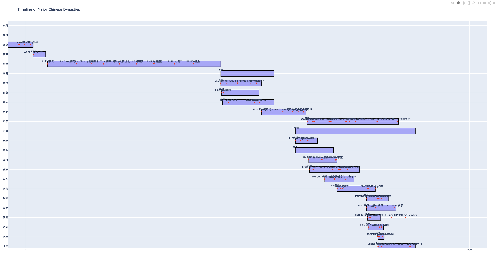

# Dynasty-Monarch

Understanding the timeline of Chinese dynasties and their monarchs has always been a challenge for me. Despite numerous attempts to memorize the start and end dates, I failed in some way. As a visual person, I prefer diagrams and interactive elements than cold text and tables.

On June 23, 2024, I discovered [Plotly](https://github.com/plotly/plotly.py), a fantastic library that seemed perfect for solving my problem. I created [this page](https://githubhy.github.io/dynasty-monarch/) to try it out. While it may be a bit messy, it works, and I encourage you to [try it out](https://githubhy.github.io/dynasty-monarch/)!

The data is sourced from Wikipedia's entries on [Chinese Dynasties](https://en.wikipedia.org/wiki/Dynasties_of_China) and [Chinese Monarchs](https://en.wikipedia.org/wiki/List_of_Chinese_monarchs). Organizing the monarch data was particularly challenging, and despite my efforts, some names are still missing from the diagram. There is certainly room for improvement.

## Future Enhancements
- [ ] Process the missing names
- [ ] Add Japanese historical periods
- [ ] Incorporate other historical timelines from around the world
